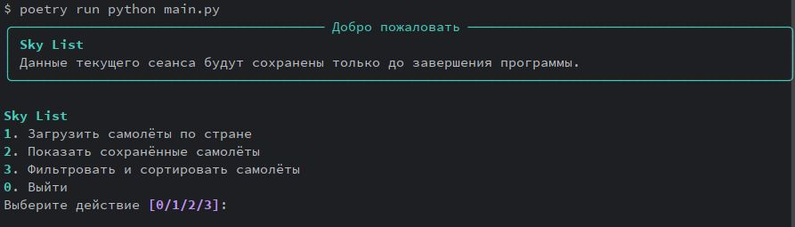
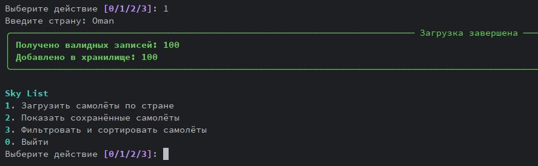
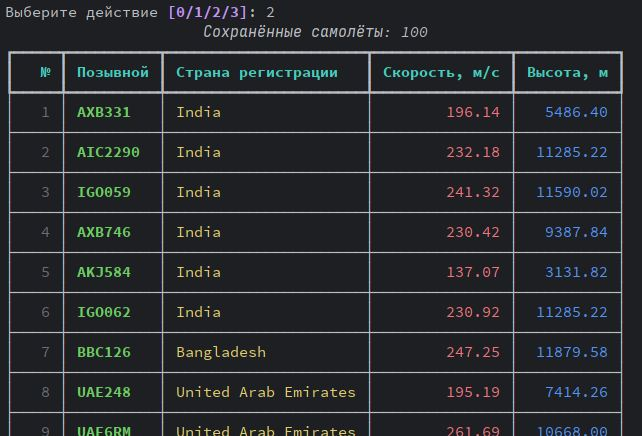
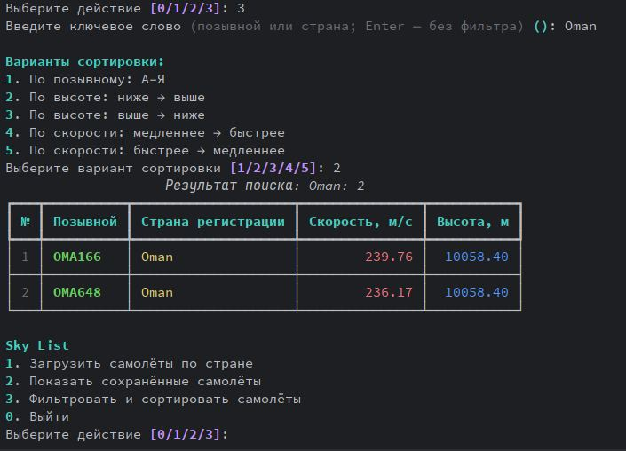
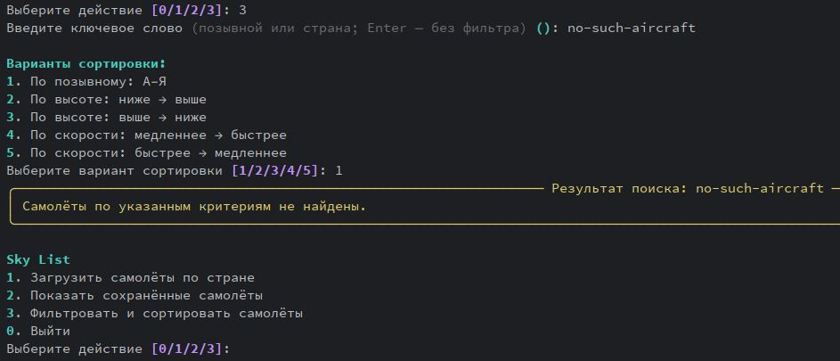

# Sky List

**Sky List** — консольное Python-приложение с интеграцией двух внешних REST API: Nominatim OpenStreetMap и OpenSky Network. Приложение получает географические границы указанной страны, формирует запрос к сервису мониторинга воздушного движения, нормализует и валидирует полученные данные о воздушных судах, а затем сохраняет уникальные записи в локальное JSON-хранилище на время текущего сеанса.

Проект реализует обработку HTTP-ответов, контроль ошибок внешних сервисов, преобразование данных в доменные объекты, сессионное хранение, фильтрацию и сортировку результатов. Пользователь взаимодействует с системой через консольный интерфейс на Rich.
Приложение получает географические координаты страны через Nominatim OpenStreetMap, запрашивает данные о воздушном движении в OpenSky Network, нормализует записи и отображает их в интерактивном интерфейсе Rich.

> Данные в хранилище относятся только к текущему запуску: при старте программы файл локального хранилища очищается.

## Возможности

- Загрузка данных о самолётах по названию страны
- Получение координат страны через Nominatim OpenStreetMap
- Получение данных об воздушных судах через OpenSky Network
- Нормализация и валидация полученных записей
- Сохранение уникальных записей в локальный JSON-файл
- Просмотр сохранённых самолётов в таблице Rich
- Поиск по части позывного или страны регистрации без учёта регистра
- Сортировка по позывному, высоте и скорости
- Отображение прогресса, понятных сообщений об ошибках и пустых результатов
- Автоматические тесты, статическая типизация и форматирование кода

## Интерфейс

После запуска приложение показывает интерактивное меню:

```text
Sky List
1. Загрузить самолёты по стране
2. Показать сохранённые самолёты
3. Фильтровать и сортировать самолёты
0. Выйти
```

### Загрузка

1. Выберите пункт `1`.
2. Введите название страны, например `Oman`.
3. Приложение получает границы страны, загружает данные о самолётах, нормализует их и добавляет новые записи в сессионное JSON-хранилище.

Если внешний сервис недоступен, вернул некорректный ответ или не удалось найти страну, приложение покажет понятное сообщение об ошибке без аварийного завершения.

### Поиск и сортировка

В пункте `3` можно:

- ввести позывной или страну регистрации;
- нажать Enter, чтобы показать все сохранённые записи;
- выбрать один из пяти вариантов сортировки.

| № | Вариант | Направление |
|---:|---|---|
| 1 | По позывному | А–Я |
| 2 | По высоте | Ниже → выше |
| 3 | По высоте | Выше → ниже |
| 4 | По скорости | Медленнее → быстрее |
| 5 | По скорости | Быстрее → медленнее |

Например, запрос `Oman` с сортировкой по высоте от меньшей к большей покажет самолёты, у которых `Oman` содержится в позывном или стране регистрации, в порядке увеличения высоты.

## Скриншоты

### Главное меню



### Загрузка данных

После ввода страны приложение показывает ход выполнения и сообщает, сколько валидных записей получено и добавлено в локальное хранилище.



### Сохранённые самолёты

Результаты текущего сеанса отображаются в таблице с позывным, страной регистрации, скоростью и высотой.



### Поиск и сортировка

Пример поиска самолётов по стране `Oman` с сортировкой по высоте от меньшей к большей.



### Пустой результат

Если записи не соответствуют введённому условию, приложение показывает понятное уведомление вместо пустой таблицы.



## Технологии

- Python 3.13
- Poetry — управление зависимостями
- Rich — интерактивный интерфейс терминала, панели, таблицы и индикаторы выполнения
- Requests — HTTP-запросы к внешним API
- Nominatim OpenStreetMap — поиск границ страны
- OpenSky Network — данные о воздушных судах
- Pytest — автоматические тесты
- MyPy — статическая проверка типов
- Black — форматирование кода
- isort — сортировка импортов

## Установка и запуск

### Требования

Перед началом работы должны быть установлены:

- Python 3.13 или новее
- Poetry
- Git

Проверка версий:

```bash
python --version
poetry --version
git --version
```

### Установка

Клонируйте репозиторий и перейдите в его каталог:

```bash
git clone [https://github.com/Alex-399745146/sky_list.git](https://github.com/Alex-399745146/sky_list.git)
cd sky_list
```

Установите зависимости, включая инструменты разработки и тестирования:

```bash
poetry install --with dev,lint,test
```

### Запуск приложения

```bash
poetry run python main.py
```

Для завершения работы выберите пункт меню `0`.

## Проверка качества

Запуск автоматических тестов:

```bash
poetry run pytest -q
```

Проверка типов:

```bash
poetry run mypy .
```

Проверка форматирования:

```bash
poetry run black --check .
```

Проверка порядка импортов:

```bash
poetry run isort --check-only .
```

Последний подтверждённый результат тестов:

```text
22 passed
```

## Структура проекта

```text
sky_list/
├── data/
│   └── aeroplanes.json      # Локальное сессионное хранилище, не хранится в Git
├── src/
│   ├── abstract.py          # Базовые абстрактные классы
│   ├── airplanes.py         # Модели и нормализация данных самолётов
│   ├── analytics.py         # Поиск и сортировка данных
│   ├── api_clients.py       # Запросы к Nominatim и OpenSky
│   ├── processing.py        # Работа с JSON-хранилищем
│   └── views.py             # CLI-интерфейс на Rich
├── tests/
│   ├── test_abstract.py
│   ├── test_airplanes.py
│   ├── test_analytics.py
│   ├── test_api_clients.py
│   └── test_processing.py
├── main.py                  # Точка входа приложения
├── pyproject.toml           # Настройки Poetry и инструментов качества
└── README.md
```

## API и данные

Приложение использует два открытых внешних сервиса:

- [Nominatim OpenStreetMap](https://nominatim.openstreetmap.org/) — для определения географических границ введённой страны
- [OpenSky Network](https://opensky-network.org/) — для получения данных о воздушных судах в пределах найденных координат

Доступность, полнота и актуальность результатов зависят от ответов внешних API и текущей воздушной обстановки. Данные могут отсутствовать, даже если страна введена корректно.

## Автор

Александр Бачевский

- GitHub: [Alex-399745146](https://github.com/Alex-399745146)
- Telegram: [@bachevskiyaa](https://t.me/bachevskiyaa)
- Email: [bachevskiyaa@bk.ru](mailto:bachevskiyaa@bk.ru)
- Email: [bachevskiiaa@gmail.com](mailto:bachevskiiaa@gmail.com)